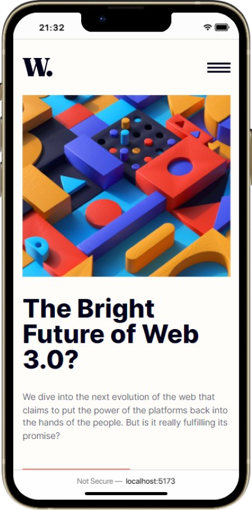
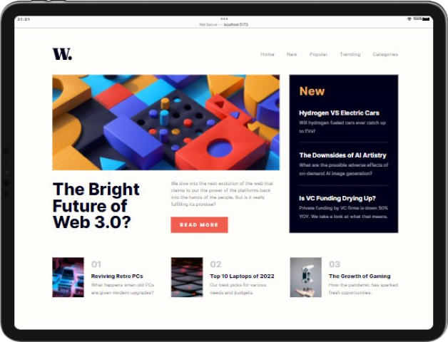
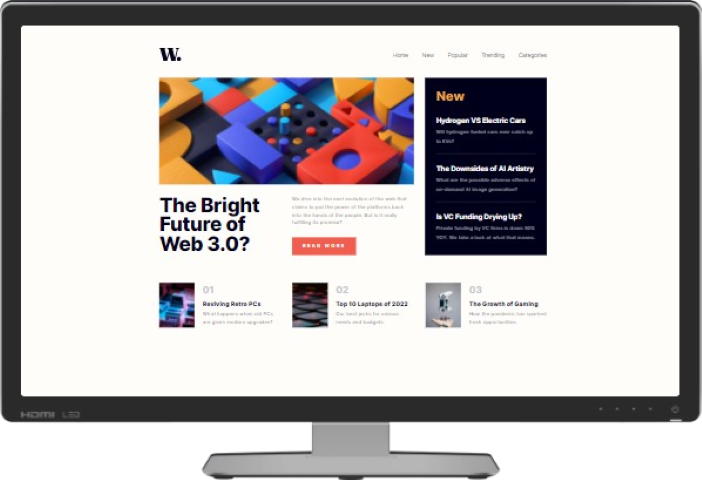

# News homepage

## What's this?

This is a solution to a [FEM](https://frontendmentor.io/) **challenge**.

It's a static website which doens't have too much going on other than Gthe layout itself. Nonetheless, it was fun to build and solve certain CSS problems in creative ways.

The layout is fully responsive.

## Tools used

- [NodeJS](https://nodejs.org)
- [Vite](https://vitejs.dev)
- [React](https://reactjs.org)
- [SASS](https://sass-lang.com) (scss)
- [Visual Studio Code](https://code.visualstudio.com/)

## [Live preview 🎨](https://news-homepage-nu-ashy.vercel.app/)

- ### Mobile view 📱
  
- ### Tablet view 📱
  
- ### Desktop view 💻
  
